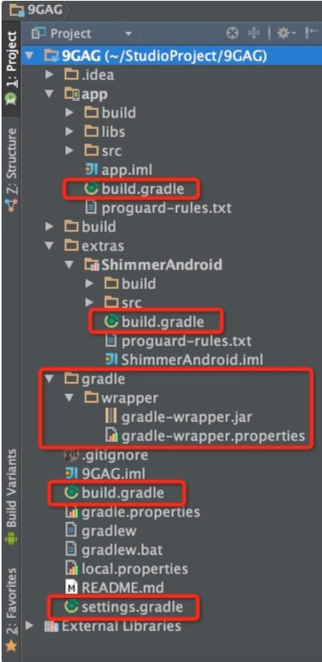

# Android Studio 使用

## 1. build.gradle相关文件介绍



## 1.1 9GAG/app/build.gradle

在app目录下面的叫Module的build.gradle，其配置文件的详情如下所示

```
// 声明是Android程序
apply plugin: 'com.android.application'

android {
    // 编译SDK的版本
    compileSdkVersion 21
    // build tools的版本
    buildToolsVersion "21.1.1"

    defaultConfig {
    	// 应用的包名
        applicationId "me.storm.ninegag"
        minSdkVersion 14
        targetSdkVersion 21
        versionCode 1
        versionName "1.0.0"
    }

    // java版本
    compileOptions {
        sourceCompatibility JavaVersion.VERSION_1_7
        targetCompatibility JavaVersion.VERSION_1_7
    }
    
    buildTypes {
        debug {
            // debug模式
        }
        
        release {
            // 是否进行混淆
            minifyEnabled false
            // 混淆文件的位置
            proguardFiles getDefaultProguardFile('proguard-android.txt'), 'proguard-rules.txt'
        }
    }
    
    // 移除lint检查的error
    lintOptions {
      abortOnError false
    }
}

dependencies {
    // 编译libs目录下的所有jar包
    compile fileTree(dir: 'libs', include: ['*.jar'])
    compile 'com.android.support:support-v4:21.0.2'
    compile 'com.etsy.android.grid:library:1.0.5'
    compile 'com.alexvasilkov:foldable-layout:1.0.1'
    // 编译extras目录下的ShimmerAndroid模块，ShimmerAndroid相当于eclipse中的Library
    compile project(':extras:ShimmerAndroid')
}
```

## 1.2 9GAG/gradle

这个目录下面有个wrapper文件夹，里面有两个文件，主要看一下gradle-wrapper.properties这个文件的内容,申明了gradle的目录与下载路径以及项目使用的gradle版本

```
#Thu Dec 18 16:02:24 CST 2014
distributionBase=GRADLE_USER_HOME
distributionPath=wrapper/dists
zipStoreBase=GRADLE_USER_HOME
zipStorePath=wrapper/dists
distributionUrl=https\://services.gradle.org/distributions/gradle-2.2.1-all.zip
```

## 1.3 9GAG/gradle

这是整个项目的gradle基础配置文件,申明了仓库源为jcenter()和android gradle plugin的版本

```
buildscript {
    repositories {
        jcenter()
    }
    dependencies {
        classpath 'com.android.tools.build:gradle:1.0.0'
    }
}

allprojects {
    repositories {
        jcenter()
    }
}
```

## 1.4  9GAG/settings.gradle

这个文件是全局的项目配置文件，里面主要声明一些需要加入gradle的module
 
```
include ':app', ':extras:ShimmerAndroid'
```

ps: 从上面的文件结构以及内容可知，加入一个library工程有如下步骤

* 将Library拷贝到app目录同级目录
* 在settings.gradle中加入Library所在目录
* 在module目录下面的build.gradle加入类似如下引用

```
compile project(':extras:ShimmerAndroid')
```

## 2. 查看源码报异常

在查看源代码时，会报如下错误

```
throw new RuntimeException("Stub!")
```

解决方法：

etting->Preferences -> Appearance & Behavior -> System Settings -> Android SDK--->点击EditAndroid SDK location 然后点击下一步--->下一步-->完成