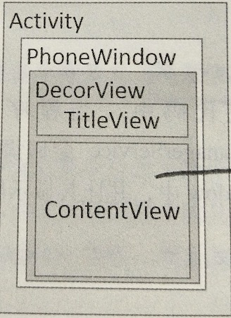

# include、merge、ViewStub

## 1. include

include 标签能够重用布局文件，当某个布局，在很多界面中都用到，可以将这个布局抽象为一个布局，然后使用include标签服用它

```
<include layout="@layout/titlebar"/>
```

## 2. merge

merge标签可以减少视图层级，在UI结构优化中起着重要的作用。比如主布局文件是垂直布局，引入一个垂直布局的include，


### 4. android布局

安卓布局由如下结构组成

* PhoneWindow。 Android 中每一个Activity的Window对象
* DecorView。 是整个应用窗口的根View即ViewParent
* LinearLayout。为DecorView的下一层，为ViewGroup
* ViewGroup下面为子view或者子ViewGroup，比如常见的上面显示TitleView下面是ContentView（ContentView是一个FrameLayout，布局文件就是设置在这个一个FrameLayout中），这就是解析了requestWindowFeature()方法为什么要在setContentView之前

