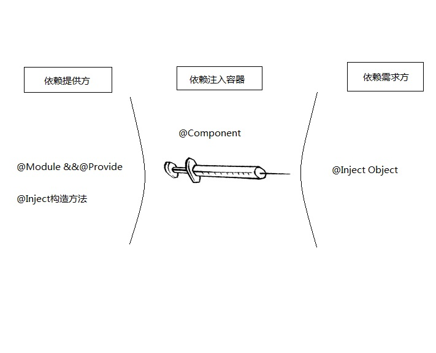

# Dagger2

## 1 Dagger2简介

Dagger2是一个依赖注入框架，类中依赖的对象只要声明就可以使用，其创建由框架来管理。
官方介绍:`Dagger2是一款基于Java注解来实现的完全在编译阶段完成依赖注入的开源库，主要用于模块间解耦、提高代码的健壮性和可维护性。Dagger2在编译阶段通过apt利用Java注解自动生成Java代码，然后结合手写的代码来自动帮我们完成依赖注入的工作。`

## 2. 注解关键字介绍

### 2.1 Component

用于标注接口，是依赖需求方和依赖提供方之间的桥梁。被Component标记的接口(在接口中主要定义了一些提供依赖的声明)在编译时会生成该接口的实现类(Dragger+Component名字)，我们通过调用这个实现类的方法完成注入

### 2.2 Module

用于标注提供依赖的类

### 2.3 Inject

### 2.4 Provides

用于标注Module所标注的类中的方法

### 2.5 Scope

### 2.6 Singleton

标记全局单例

