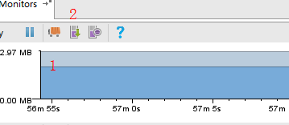
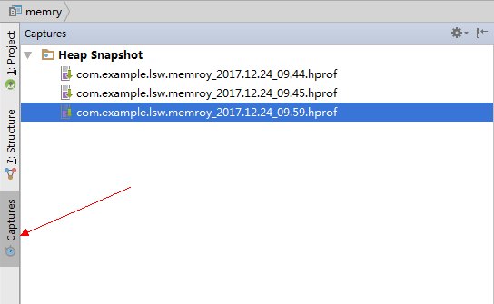
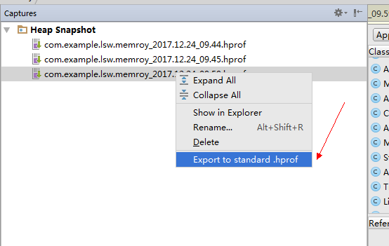

# MAT 性能分析工具的使用

# 1. MAT介绍

MAT工具全称为Memory Analyzer Tool，一款详细分析`Java`堆内存的工具

## 2. MAT的使用

### 2.1 使用`Android studio` 生成 `hprof`文件

* 先点击1，进行`GC`回收，回收掉优先级级低的，避免对分析造成失误
* 再点击2,获取`hprof`文件，稍等片刻就可以生成`hprof`文件

### 2.2 转化标准的`hprof`文件

由于使用`Android Studio`工具生成的`hprof`文件是非标准的`hprof`文件，这是无法被`MAT`工具分析，因此要将其转换为标准的`hprof`文件。步骤如下:

### 2.3 选择`Android studio`工具栏的`Captures`

###  2.4 导出标准`hprof`文件

###  2.5 将导出的标准`hprof`文件导入`MAT`中

点击File->Open File

## 3. `MAT`数据分析

### 3.1 查看当前内存占用情况

### 3.1.1 点击`Histogram`,查看每一个类中实例对象

.jpg)

### 3.1.2 内存消耗分析

.jpg)&

* `Class Name` 类名
* `Objects`对象数
* `Shallow Heap`对象自身所占用的内存,不包括它的引用对象
* `Retained Heap`对象自身大小+对象直接或者间接应用到对象的大小之和

## 3.2 对比多次内存消耗情况

通过多次`hprof`文件的对比，可以帮助我们找出问题的原因

进入`histogram `,选择一个`hprof`文件点击中间菜单栏`Navigation History` ,右击`histogram`，选择`Add to Compare Basket`,选择另外一个`hprof`文件重复上述操作

.jpg)

再上述操作完成以后，点击`Compare Basket`中的红色感叹号就会出现两个`hprof` 内存消耗对比，如果一个对象内存剧增，就有很大的怀疑嫌疑

.jpg)