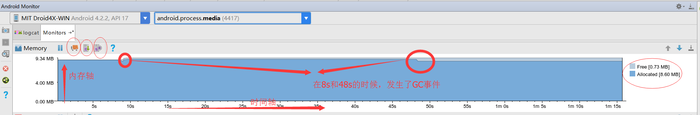

# Memory Monitor详细使用

## 1. Memory Monitor介绍

`Memory Monitor`是`Android Monitor`的一种，其主要用于内存分析。`Android Monitor`主要包括`Memory Monitor` ,`CPU Monitor` ,`NetWork Monitor`, `GPU Monitor`等四种 。

## 2.  Memory Monitor具体使用

## 2.1 内存泄露举例代码

```java
public class UserManger {

    private static UserManger instance;

    private Context context;

    private UserManger(Context context) {
        this.context = context;
    }

    public static UserManger getInstance(Context context) {
        if (instance == null) {
            instance = new UserManger(context);
        }
        return instance;
    }
}
```


```java
public class MainActivity extends AppCompatActivity {

    @Override
    protected void onCreate(Bundle savedInstanceState) {
        super.onCreate(savedInstanceState);
        setContentView(R.layout.activity_main);
        UserManger userManger = UserManger.getInstance(this);
    }
}

```

## 2.2  Memory Monitor主界面介绍



* 水平方向是时间轴，竖直方向是内存分配情况
* 深蓝色区域是正在使用的内存量，浅灰色是未分配内存
* 左上角工具栏三个圆圈依次代表:手动GC回收垃圾，内存快照(记录某一个时间点内，程序内存详细情况)，Allocation Traking(通过两次点击生成一个alloc结尾的文件，可知那些代码使用了内存)