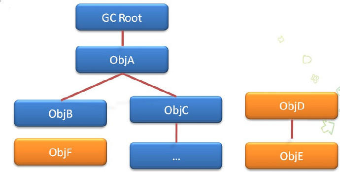

# 初识内存泄露

## 1. `Java`内存区域划分

主要划分为堆内存(Heap)和栈内存(Stack)

## 1.1  栈内存 

存放方法中的一些变量值以及方法中堆内存中对象的引用，在方法执行完以后就销毁释放掉，其特点是分配的分配的运算速度很快(内置在处理器里面)

## 1.2  堆内存

存放由new 创建的对象(类的成员变量属于类，也是new出来的，因此也存放在堆内存中)和数组，由`java` 虚拟机垃圾回收器`GC`管理

###  1.3 静态内存

静态内存在整个程序运行期间一直存在，主要存放静态数据


## 1.3 堆内存和栈内存两者区别

堆内存是不连续的区域，堆空间比较灵活，其管理比较麻烦，频繁的new/remove会造成大量的内存碎片，栈内存是一块连续的内存区域，先进后出，不会产生碎片，运行效率高效

## 1.4 代码举例

```java
public class People{
    // a存放在堆内存
    int a = 1;
    // s1对象以及其对象的应用方法堆内存中
    Student s1 = new Student();
    public void XXX(){
        // b存放在栈内存中
        int b = 1;
        // s2对象放在堆内存中，s2的对象引用放在栈内存中
        Student s2 = new Student();
    }
}
```

## 2 `Java`引用方式

### 2.1 强引用 

只要某个对象有强引用与之关联，该对象就不会被回收，`JVM`停止的时候才终止,这在代码中普遍存在，如下所示

```java
Object object = new Object();
String str = "hello";
```

当引用变量被回收或者置为null时，与之关联的对象就会在合适的时候被`GC`回收

### 2.2  软引用(`SoftReference`) 

软引用关联的对象，当内存不足时，才会被`GC`回收。

## 2.3 弱引用(`WeakReference`) 

弱引用关联的对象，无论内存是否充足，`GC`回收时该对象都会被销毁。

### 2.4 虚引用(`PhantomReference`)   

虚引用关联的对象，跟没有与其关联是的，在任何时候都可能被`GC`回收

## 3.  内存泄露定义以及发生的场景

### 3.1 内存泄露

当一个对象已经不需要使用了，本应该被回收，而另外一个正在使用的对象持有它的引用，从而导致对象不能回收，这种本应该被回收但不能回收而继续停留在堆内存中的现象就是内存泄露。

### 3.2 发生场景

todo 


## 4. 垃圾回收器(GC)

## 4.1 什么是GC

GC 是 garbage collection 的缩写，是Java回收堆内存的一种机制

## 4.2 GC算法

根搜索算法



程序把所有的引用关系看作一张图，从一个节点`GC ROOT`开始，寻找对应的引用节点，找到这个节点以后，继续寻找这个节点的引用节点，当所有的引用节点寻找完毕之后，剩余的节点则被认为是没有被引用到的节点，即无用的节点。如果这个对象是引用可达的, 则称之为活的(live), 反之, 如果这个对象引用不可达, 则称之为死的(dead), 也可以称之为垃圾(garbage).这个引用可达与不可达就是相对于GC Root来说的

##  